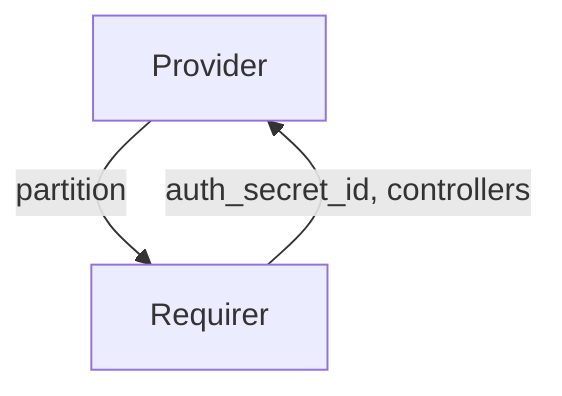

# `charmed-slurm-slurmd-interface`

## Usage

This package provides the integration interface implementation for the `slurmd` interface.
It enables `slurmd` (Slurm compute daemon) applications to exchange data with the `slurmctld` controller.
`slurmd` receives authentication secrets and controller addresses, and provides partition
configuration back to `slurmctld`.

To install, add `charmed-slurm-slurmd-interface` to your Python dependencies.
Then in your Python code, import as:

```python
from charmed_slurm_slurmd_interface import (
    ComputeData,
    SlurmdProvider,
    SlurmdRequirer,
    controller_ready,
    partition_ready,
)
```

## Direction

The `slurmd` interface implements a provider/requirer pattern.
The Provider is the `slurmd` application that provides partition data to `slurmctld` and receives controller data.
The Requirer is the `slurmctld` application that provides controller data and consumes partition configuration from `slurmd`.



## Behavior

The `slurmctld` requirer provides controller data (authentication secret and controller addresses) to the `slurmd`
provider. In turn, the `slurmd` provider publishes its partition configuration so that `slurmctld` can incorporate
compute nodes into the cluster configuration.

### Provider

- Is expected to validate that the application databag contains `auth_secret_id` and `controllers` before becoming ready.
- Is expected to call `set_compute_data` to publish `ComputeData` containing the partition configuration.
- Is expected to only set compute data as the application leader.
- Is expected to emit `SlurmctldConnectedEvent` when the relation to `slurmctld` is created (leader only).
- Is expected to emit `SlurmctldReadyEvent` when valid controller data is available.
- Is expected to emit `SlurmctldDisconnectedEvent` when the relation is broken.

### Requirer

- Is expected to emit `SlurmdConnectedEvent` when a new `slurmd` application is connected (leader only).
- Is expected to emit `SlurmdReadyEvent` when partition data is available in the `slurmd` application databag (leader only).
- Is expected to emit `SlurmdDisconnectedEvent` when the `slurmd` application is disconnected (leader only).
- Is expected to call `get_compute_data` to retrieve `ComputeData`.
- Is expected to publish `ControllerData` with at least `auth_secret_id` and `controllers` fields populated.

## Integration data

Data is exchanged through the Juju integration application databag in both directions.
The `slurmd` requirer sets controller data (including Juju Secret IDs for authentication keys) on
its application databag. The `slurmd` provider sets partition data on its own application databag as a JSON-serialized
`Partition` object from `slurmutils`.

[[Source]](src/charmed_slurm_slurmd_interface/__init__.py)

### Example

```yaml
provider:
  app:
    partition: '{"PartitionName": "compute", "Nodes": "node[01-10]", "State": "UP"}'
  unit: {}
requirer:
  app:
    auth_secret_id: "secret:abc123"
    controllers: '["10.0.0.1", "10.0.0.2"]'
  unit: {}
```

## Examples

### Provider charm

```python
"""Example slurmd charm providing partition data to slurmctld."""

import ops
from charmed_slurm_slurmd_interface import ComputeData, SlurmdProvider
from slurmutils import Partition


class SlurmdCharm(ops.CharmBase):
    """A slurmd charm that provides partition configuration."""

    def __init__(self, framework: ops.Framework) -> None:
        super().__init__(framework)
        self.slurmctld = SlurmdProvider(self, "slurmctld")
        self.framework.observe(
            self.slurmctld.on.slurmctld_ready, self._on_slurmctld_ready
        )

    def _on_slurmctld_ready(self, event: ops.RelationEvent) -> None:
        """Publish partition data once controller data is available."""
        partition = Partition(
            {"PartitionName": "compute", "Nodes": "node[01-10]", "State": "UP"}
        )
        self.slurmctld.set_compute_data(ComputeData(partition=partition))
```

### Requirer charm

```python
"""Example slurmctld charm consuming partition data from slurmd."""

import ops
from charmed_slurm_slurmd_interface import ComputeData, SlurmdConnectedEvent, SlurmdRequirer
from charmed_slurm_slurmctld_interface import ControllerData


class SlurmctldCharm(ops.CharmBase):
    """The slurmctld charm that consumes partition data from slurmd."""

    def __init__(self, framework: ops.Framework) -> None:
        super().__init__(framework)
        self.slurmd = SlurmdRequirer(self, "slurmd")
        self.framework.observe(
            self.slurmd.on.slurmd_connected, self._on_slurmd_connected
        )
        self.framework.observe(
            self.slurmd.on.slurmd_ready, self._on_slurmd_ready
        )
        self.framework.observe(
            self.slurmd.on.slurmd_disconnected, self._on_slurmd_disconnected
        )

    def _on_slurmd_connected(self, event: SlurmdConnectedEvent) -> None:
        """Provide controller data when a slurmd application connects."""
        data = ControllerData(
            auth_secret_id="secret:abc123",
            controllers=["10.0.0.1"],
        )
        self.slurmd.set_controller_data(data, integration_id=event.relation.id)

    def _on_slurmd_ready(self, event: ops.RelationEvent) -> None:
        """Handle when partition data is available."""
        data: ComputeData = self.slurmd.get_compute_data()
        # Use data.partition to update slurm.conf

    def _on_slurmd_disconnected(self, event: ops.RelationEvent) -> None:
        """Handle when a slurmd application is disconnected."""
```
