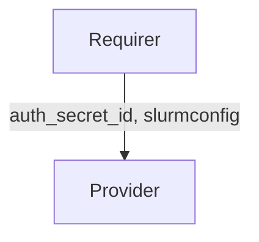

# `charmed-slurm-slurmrestd-interface`

## Usage

This package provides the integration interface implementation for the `slurmrestd` interface. It enables
`slurmrestd` (Slurm REST API daemon) applications to receive controller data from `slurmctld`,
including authentication secrets and the Slurm configuration.

To install, add `charmed-slurm-slurmrestd-interface` to your Python dependencies.
Then in your Python code, import as:

```python
from charmed_slurm_slurmrestd_interface import (
    SlurmrestdProvider,
    SlurmrestdRequirer,
    controller_ready,
)
```

## Direction

The `slurmrestd` interface implements a provider/requirer pattern.
The Provider is the `slurmrestd` application that receives controller data from `slurmctld`.
The Requirer is the `slurmctld` application that provides authentication secrets and Slurm configuration to `slurmrestd`.



## Behavior

The `slurmctld` requirer provides controller data (authentication secret and Slurm configuration) to the
`slurmrestd` provider. The `slurmrestd` provider does not send data back; it only consumes controller
data to configure the REST API daemon.

### Provider

- Is expected to validate that the application databag contains `auth_secret_id` and `slurmconfig` before becoming ready.
- Is expected to emit `SlurmctldConnectedEvent` when the relation to `slurmctld` is created.
- Is expected to emit `SlurmctldReadyEvent` when valid controller data is available.
- Is expected to emit `SlurmctldDisconnectedEvent` when the relation is broken.

### Requirer

- Is expected to emit `SlurmrestdConnectedEvent` when a new `slurmrestd` application is connected (leader only).
- Is expected to publish `ControllerData` with at least `auth_secret_id` and `slurmconfig` fields populated.

## Integration data

Data is exchanged through the Juju integration application databag. The `slurmctld` requirer sets controller
data including Juju Secret IDs for authentication and the Slurm configuration on its application databag.
The `slurmrestd` provider consumes this data but does not write to its own application databag.

[[Source]](src/charmed_slurm_slurmrestd_interface/__init__.py)

### Example

```yaml
provider:
  app: {}
  unit: {}
requirer:
  app:
    auth_secret_id: "secret:abc123"
    slurmconfig: '{"slurm.conf": {"SlurmctldHost": "controller-0"}}'
  unit: {}
```

## Examples

### Provider charm

```python
"""Example slurmrestd charm receiving controller data from slurmctld."""

import ops
from charmed_slurm_slurmrestd_interface import SlurmrestdProvider, controller_ready


class SlurmrestdCharm(ops.CharmBase):
    """A slurmrestd charm that receives controller data."""

    def __init__(self, framework: ops.Framework) -> None:
        super().__init__(framework)
        self.slurmctld = SlurmrestdProvider(self, "slurmctld")
        self.framework.observe(
            self.slurmctld.on.slurmctld_ready, self._on_slurmctld_ready
        )
        self.framework.observe(
            self.slurmctld.on.slurmctld_disconnected, self._on_slurmctld_disconnected
        )

    def _on_slurmctld_ready(self, event: ops.RelationEvent) -> None:
        """Handle when controller data is available."""
        data = self.slurmctld.get_controller_data()
        # Use data.auth_key and data.slurmconfig to configure slurmrestd

    def _on_slurmctld_disconnected(self, event: ops.RelationEvent) -> None:
        """Handle when controller data is no longer available."""
```

### Requirer charm

```python
"""Example slurmctld charm providing controller data to slurmrestd."""

import ops
from charmed_slurm_slurmrestd_interface import SlurmrestdConnectedEvent, SlurmrestdRequirer
from charmed_slurm_slurmctld_interface import ControllerData


class SlurmctldCharm(ops.CharmBase):
    """The slurmctld charm that provides controller data to slurmrestd."""

    def __init__(self, framework: ops.Framework) -> None:
        super().__init__(framework)
        self.slurmrestd = SlurmrestdRequirer(self, "slurmrestd")
        self.framework.observe(
            self.slurmrestd.on.slurmrestd_connected, self._on_slurmrestd_connected
        )

    def _on_slurmrestd_connected(self, event: SlurmrestdConnectedEvent) -> None:
        """Provide controller data when slurmrestd connects."""
        data = ControllerData(
            auth_secret_id="secret:abc123",
            slurmconfig={"slurm.conf": {"SlurmctldHost": "controller-0"}},
        )
        self.slurmrestd.set_controller_data(data, integration_id=event.relation.id)
```
